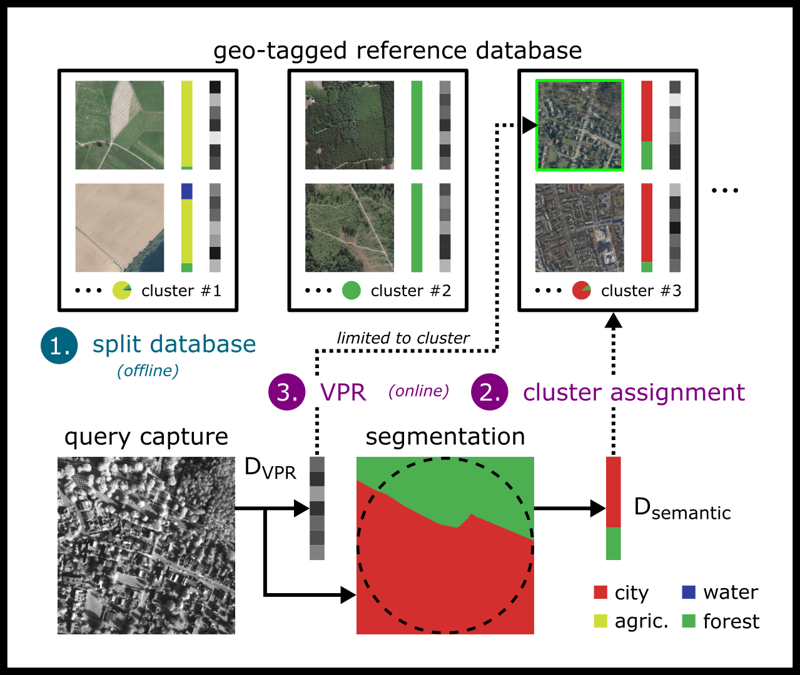

# Semantic Clustering for Visual Localization

This repository contains the code for WACV 2025 paper *Semantic Clustering of Image Retrieval Databases used for Visual Localization*. The code can be used to adapt the procedure to other datasets and to reproduce our results after publishing the entire 4 Seasons dataset. The individual submodules that realize the individual components of our pipeline are collected here.

    

## Data access

The data used within our experiments can be accessed using [this link](https://terabox.com/s/1jn1RDM4hcOawmXh7EXBpBg).

## Visual Place Recognition

In our experiments, we use [NetVlad](https://arxiv.org/abs/1511.07247) to learn VPR descriptors which form a image retrieval database. For implementation, we used [this repository](https://github.com/Nanne/pytorch-NetVlad), which we adapted to our dataset and managed in `pytorch-NetVlad`.

## Semantic Clustering

For semantic clustering we used a script for learning (semantic) clusters based on the semantic distributions within the semantic segmentation masks. Based on the learned clusters, we (soft-)assign query captures to search spaces and match VPR descriptors within the reduced search space. Our scripts for this are managed in `sem-clustering`.

## Semantic Segmentation

Results of semantic segmentation are used as input for semantic clustering. For this, we trained a model that segments aerial captures in grayscale into basic forms of land cover. Our code for this is managed in `sem-training`.
