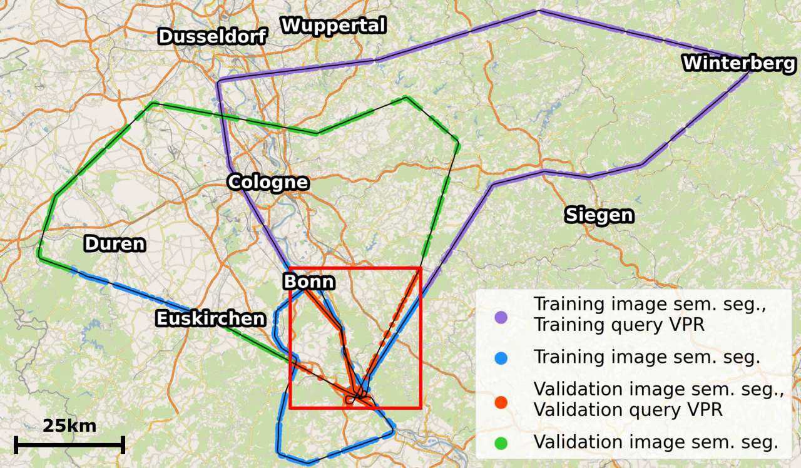

# pytorch-NetVlad

Implementation of [NetVlad](https://arxiv.org/abs/1511.07247) in PyTorch, including code for training & evaluating the model on the FourSeasons dataset. Forked from [here](https://github.com/Nanne/pytorch-NetVlad).

## Adaptions

    

In *fourseasons.py* data loading of our dataset in the NetVLAD pipeline is managed, which uses the information given in *data*. There, database images are named in a *x_y_z* format, where *x* and *y* are UTM coordinate (within zone 32U) and *z* is the height above ground used to calculate the bounding box of the image.. In *evaluate_clustering.py* the VPR evaluation of the soft-assigned queries is implemented, which needs extraced features from the testing, enabled by `--storetest`. The evaluation might then be called by:

``
python3 evaluate_clustering.py --query_features_file query_features_val.npy --db_features_file database_features_val.npy
``